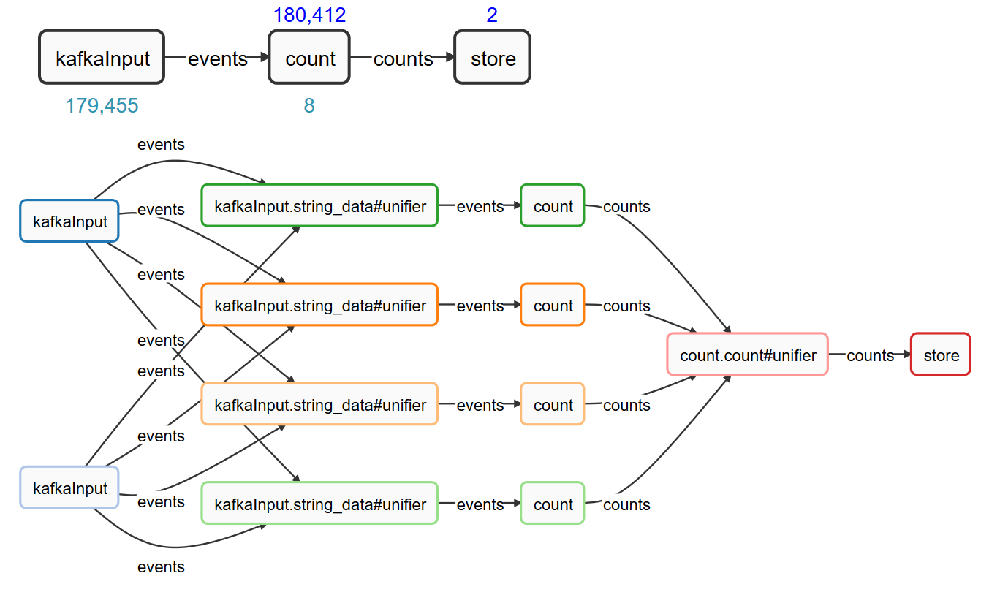
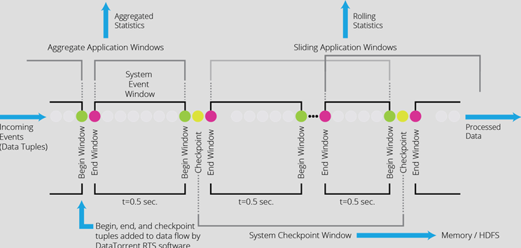
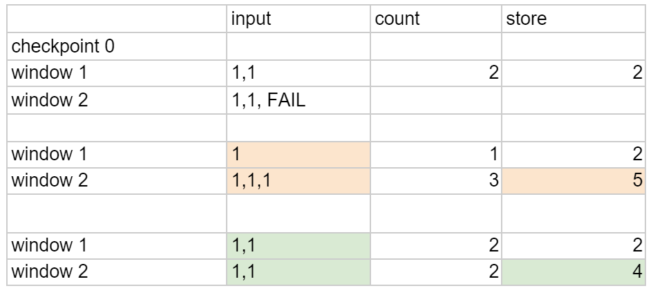

#End-to-end “Exactly-Once” with Apache Apex

Apache® Apex (http://apex.incubator.apache.org/), a stream processing platform that is currently incubating at the Apache Software Foundation, helps you build processing pipelines with fault tolerance and strong processing guarantees. Apex’s architecture is equipped with the capability for low-latency processing, scalability, high availability, and operability. What’s more, the Apex Malhar operator library comes with a wide range of connectors for out-of-the-box integration with your existing infrastructure to consume data from and land the processing results.

One of the strong points of Apex is fault tolerance. Apex guarantees no loss of data and computational state. In the event of failure, automatic recovery will ensure that processing resumes from where it left off. Processing guarantees in stream processing systems are frequently discussed and compared. Predominantly focus is on the platform in isolation and does not take into account interaction with external systems. While the stream processing platform should provide guarantees for data reliability, it cannot by itself provide a guarantee like exactly once when external systems are involved. However, such interaction is rather the norm in real world applications.

Apex can deliver exactly-once semantics through the connectors, working in conjunction with the engine. Let’s see how this works, based on a typical integration scenario, and using connectors that are readily available in the operator library.

##Example topology

Apex applications are specified as [Directed Acyclic Graphs or DAGs](https://www.datatorrent.com/blog/tracing-dags-from-specification-to-execution/). DAGs express processing logic using operators (vertices) and streams (edges), thereby providing a way to describe complex logic for sequential or parallel execution and breaking up the application logic into smaller functional components. The example scenario, expanding on word count, will use the favorite [connector to read from Apache Kafka](https://www.datatorrent.com/blog-read-with-kafka), perform the aggregation (stateful operation) and write the results to a database, using JDBC. The diagram shows logical and physical view, with color coding for processes that are distributed in the cluster:



The “kafkaInput” operator has multiple partitions, each of which can consume from one or multiple Kafka partitions that are distributed across the different brokers (this mapping is configurable). You can also see a shuffle to the count operator with 4 partitions, and a unifier for the count, which brings together the output of multiple partitions for downstream processing.

Since it is a streaming source the data flow is unbounded, however we would like to periodically see the aggregate count. Apex supports the concept of an application window where operators have the option of performing certain operations periodically apart from the normal processing of data. In this case the count operator will aggregate over a window, retain the aggregates as state for the duration of the window, emit them at the end of the window and clear the state.

The store operator will write the aggregates it receives to the database. Let us further assume that it is very important that we count “exactly-once” (do not miss words and do not double count in case there are failures during processing). The DAG expressed in Java looks like this:

```
@Override
  public void populateDAG(DAG dag, Configuration conf)
  {
    KafkaSinglePortStringInputOperator kafkaInput = dag.addOperator("kafkaInput", new KafkaSinglePortStringInputOperator());
    kafkaInput.setIdempotentStorageManager(new IdempotentStorageManager.FSIdempotentStorageManager());
    UniqueCounterFlat count = dag.addOperator("count", new UniqueCounterFlat());
    CountStoreOperator store = dag.addOperator("store", new CountStoreOperator());
    store.setStore(new JdbcTransactionalStore());
    ConsoleOutputOperator cons = dag.addOperator("console", new ConsoleOutputOperator());
    dag.addStream("words", kafkaInput.outputPort, count.data);
    dag.addStream("counts", count.counts, store.input, cons.input);
  }
```

You can find the source code as a Maven project [here](https://github.com/tweise/apex-samples/blob/master/exactly-once/src/main/java/com/example/myapexapp/Application.java). It will also demonstrate how the functionality including external system interactions like Kafka and hsqldb can be exercised with embedded mode in a unit test, without any external setup. Let’s have a closer look at how “exactly-once” works in this scenario and which component contributes what. 

##State in the operator

Apex connectors that retrieve data from an external system need to ensure they can recover the input in the event of failure. This means rewinding the stream and replaying data from the source that wasn’t fully processed. The capabilities of the external system determine how complex such recovery is. Kafka already handles message persistence and, just like when reading from files, allows for replaying the message stream directly. What remains is for the Apex input operator to remember the offsets. Compare, for example, to JMS, and the operator has to do a lot of juggling to write messages to a log that can be used for recovery, prior to “acknowledgement”. It’s not easy to implement and also not efficient.

Likewise, there is some work the operator writing to an external system needs to do. Again, the exact mechanism will depend on the external system. In this case, we utilize the transaction support of the database. The last processed window id is stored along with the application data modified in the window. On recovery and replay, it can be used to detect what was already processed and skip instead of writing duplicates. This technique permits to make results available in the database with minimized latency. It requires idempotency, or the guarantee that events are always delivered in the same window on replay, provided by Apex.

##Platform support

The Apex engine enables stateful fault tolerance. This means all state, including the state of the master (or controller), the state of operators (the units processing the streams) as well as the data in motion can be recovered. Recovery of any failed component is automatic. Apex also supports stateful restart of an application from its previous state. That’s useful in cases where the Hadoop cluster needs to be brought down for maintenance or upgrades or the application needs modifications that cannot be performed on the fly. Read more about Apex high-availability [here](https://www.datatorrent.com/efficient-ha-the-lunch-test/).

##Checkpointing

To be able to recover the state of an operator, it needs to be saved, or [checkpointed](https://www.datatorrent.com/blog-introduction-to-checkpoint/). In Apex this is done through a pluggable mechanism which by default serializes the operator state and saves it to the Hadoop file system. These checkpoints are performed periodically and automatically. Compared to in-memory processing checkpointing is an expensive operation and the interval between checkpoints is chosen to represent a balance between performance and speed of recovery. The interval is configurable and the storage for the checkpointed state customizable, thereby allowing applications that are especially performance sensitive to, for example, use a distributed in-memory store for checkpointing.

To achieve scalability and fault tolerance, Apex will checkpoint the operator state at a “window boundary”. Think of it as a marker in the event stream. The stream is a sequence of tuples, sliced into “streaming windows”. User code processes each tuple as it arrives without having to wait for a window boundary; these boundaries present the opportunity for both, user code (for example aggregation) and the engine (in this example checkpointing) to perform additional operations. Since window boundaries are identifiable and propagated through all streams in the topology, they can be used to checkpoint a consistent distributed state for the entire DAG in a decentralized, asynchronous manner.



##“Exactly-Once” processing

Apex, through the combined capabilities of engine and connector implementation, can guarantee processing without loss of data or duplicates with respect to external systems. Even though there is no such thing as strict exactly-once in the distributed system, the equivalent end effect can be derived from the consistent state across all operators of the application provided by checkpointing, plus ability to replay the portion of the stream that was not yet reflected in a checkpoint (“at-least-once” processing mode) and idempotency (recompute leading to the same result). 

For the Kafka input operator to support this, it needs to remember which events were consumed in which window to be able to replay and allow downstream processing to recompute the streaming windows in the same order when a rewind of the stream occurs after recovery. Kafka preserves the data and the operator tracks the offset ranges.

The processing guarantee applies to the word counts, stored in a database, updated after every window. We want to make sure that we count every event, which can be covered with at-least-once guarantee. Not losing data is a guarantee most stream processing systems will provide and most useful applications will need. Beyond that are use cases that besides of not dropping events also cannot afford to double count (such as billing and payment processing).

In this example, the JDBC output operator will, as part of every transaction that updates the word counts, also record the last processed window in an extra metadata table. By comparing the current window id with the one last stored, the operator will know whether the update already happened or not. Remember that works because on replay, the events are presented in the same order and window sequence, guaranteed by input operator and engine.

The concept of the streaming window also enables efficiency: Multiple updates to the database can be batched and committed as larger transaction and aggregation at the window boundary reduces data sent through the stream and thus the number of database updates. Using the JDBC connector from Malhar, the code for updating the word count is straightforward:

```
    public static class CountStoreOperator extends AbstractJdbcTransactionableOutputOperator<KeyValPair<String, Integer>>
      {
        public static final String SQL =
            "MERGE INTO words USING (VALUES ?, ?) I (word, wcount)"
            + " ON (words.word=I.word)"
            + " WHEN MATCHED THEN UPDATE SET words.wcount = words.wcount + I.wcount"
            + " WHEN NOT MATCHED THEN INSERT (word, wcount) VALUES (I.word, I.wcount)";
    
        @Override
        protected String getUpdateCommand()
        {
          return SQL;
        }
    
        @Override
        protected void setStatementParameters(PreparedStatement statement, KeyValPair<String, Integer> tuple) throws SQLException
        {
          statement.setString(1, tuple.getKey());
          statement.setInt(2, tuple.getValue());
        }
      }
```
Let’s consider how idempotency is necessary to ensure exactly once semantics with respect to the database output in the event of failure and replay. The Kafka consumer by itself is aware of the offset, but not the Apex window boundary and therefore not idempotent. The following example will show how the words are emitted within windows by the Kafka input operator and how the window boundary can change the computed results, when not idempotent: 



Checkpoints occur every 2 windows. The input operator emits 2 tuples per window and fails in the second window (before checkpointing again). At that time, the count as of first window was committed to the database. Upon recovery the input operator will be reset to the checkpoint before window 1 and both windows replay. The count for window 1 is now ignored since it was recorded as the last processed window before the failure. The remaining rows in the table show how the correctness of the result depends on idempotency of the input operator, i.e. the events must be emitted in the same windows or it can lead to incorrect total (5) stored in the database.

An alternative approach is to defer any effect on external systems until the window is “committed”, which means it has been checkpointed throughout the entire topology and there is no possibility it will be recomputed due to replay. For this, the engine provides the `committed` callback in `CheckpointListener` that allows each operator to know the latest final window id. The operator developer can use it as the trigger to finalize state, for example by doing an atomic rename on files (which is how the Apex Malhar `FileOutputOperator` is fault tolerant with no duplication). Compared to the idempotent input operator, this approach introduces a delay before results become visible and increases the end to end latency.

##Idempotency and Kafka Operator Offset Management

The Apex Kafka input operator uses SimpleConsumer and therefore tracks the offset for each partition. To achieve idempotency, input operators need to remember which events were received and emitted into the topology for each streaming window until those windows are committed and the associated state is no longer required for recovery. The Kafka input operator supports idempotency (as an option). When enabled, the offset for every window will be recorded to durable storage (HDFS by default) at the end of each window. The associated state is a set of (window, offset) pairs. In case of recovery it will rewind and replay the windows in the *same* sequence and the *same* per-window content as before. Unlike with other sources that will require the receiver to temporarily backup the data for fault tolerance, Kafka maintains the data and the consumer only needs to track the offsets.

##Simplified Kafka integration with new 0.9 consumer API

The Apex Kafka input and output operators work with Kafka 0.8.x. The recent release of Apex Malhar 3.3.0 added support for the new Kafka 0.9 consumer API with a new input operator implementation (0.8.x continues to be supported).

The 0.8.x API had simple and high level consumers. The Apex connector was using the simple consumer API as it provided the explicit offset control that is required for the Apex processing guarantees. The new unified consumer API provides all the controls we previously used in an easier and more intuitive fashion. The Kafka client no longer needs to deal with **ZooKeeper**.

Offset tracking is now directly supported in the API. In the Apex operator it is used to periodically store the last processed offset for future cold restart (offsets are otherwise checkpointed with the operator for recovery). The possible choices for initial offset are earliest, latest, or continue from most recently consumed offset. With `SimpleConsumer`, this required custom coding prior to topic offset storage in 0.8.2.

The new API also reduces the number of consumer threads: Previously we needed one thread per broker. Now a single thread for all partitions across brokers is adequate. In most cases, a single instance of the Apex `KafkaInputOperator` will consume multiple partitions. Previously this required a consumer thread for each broker and therefore extra resources that were not utilized with larger clusters. With 0.9 a single thread can handle partitions from multiple brokers.

The new API simplifies the Apex operator implementation and much of the code that was needed earlier to work with `SimpleConsumer` is no longer needed. For example, detection of connection failure and failover to the new lead broker is now handled by the Kafka API. Before, metadata monitoring and reconnect had to be implemented in user land. Finally, offset commit is now available as part of the consumer API and obsoletes the need for an extra component dedicated to store offsets for cold restart.

##In a nutshell

Apache Apex is the foundation for fully fault tolerant stream processing. It has a library of connectors that cover many common integration scenarios. End to end “exactly once” is the combination of at-least-once semantics, idempotent processing and state checkpointing within the DAG. The [Kafka to JDBC example](https://github.com/tweise/apex-samples/tree/master/exactly-once) shows how the above is achieved through:

  1. Window ID to Kafka offset range mapping logged in HDFS to achieve idempotency
  1. Metadata table to store committed window in the database
  1. JDBC transaction to make the writes of application data and metadata atomic

Future blogs will cover additional scenarios with different input sources and destinations for the processing results, stay tuned!
