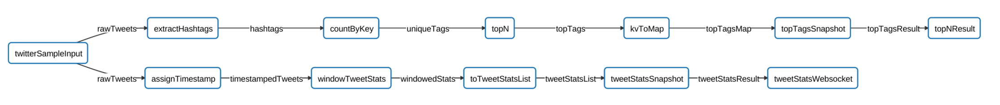

Apex Twitter Example
===============================

This example application will process a Tweet stream to perform windowed aggregation.
It demonstrates the windowing features and can be configured to visualize the results.

By default the application will read recorded Tweets from a file and send the JSON output
to stdout. 

The application can be configured to consume Tweets from the Twitter Sample Stream and
output results to Websocket. You can use [Pub/Sub Server](https://github.com/atrato/pubsub-server)
to collect the data and Grafana with the [Apex Grafana Datasource](https://github.com/atrato/apex-grafana-datasource-server) for real-time visualization.

The DAG will look like this:



To configure the application:

```
cp ./twitterDemoProperties_template.xml ./twitterDemoProperties.xml
```

Edit `./twitterDemoProperties.xml`

To use the Twitter API, obtain your own credentials and update the properties
in the file.

Following properties control the input source and output:

```xml
  <property>
    <name>twitterDemo.isTwitterSampleInput</name>
    <value>true</value>
  </property>

  <property>
    <name>twitterDemo.isWebsocketOutput</name>
    <value>false</value>
  </property>
```

For Websocket output, first run the Pubsub server,
then launch the application from the workspace directory:

```
apex> launch target/twitter-demo-1.0-SNAPSHOT.apa -conf ./twitterDemoProperties.xml 
```

Check latest result:

```
curl http://localhost:8890/ws/v1/pubsub/topics/twitter.topHashtags
curl http://localhost:8890/ws/v1/pubsub/topics/twitter.tweetStats
```

To inspect the data with [Simple Websocket Client browser extension](https://chrome.google.com/webstore/detail/simple-websocket-client/pfdhoblngboilpfeibdedpjgfnlcodoo?hl=en) use:

Server location: `ws://localhost:8890/pubsub`

Request: `{"type":"subscribe", "topic":"twitter.topHashtags"}`

Sample response for table data:
```json
{
  "type": "data",
  "topic": "twitter.topHashtags",
  "data": {
    "id": "topHashtags",
    "type": "dataResult",
    "data": [
      {
        "count": "24",
        "label": "0",
        "hashtag": "BTSBBMAs"
      },
      {
        "count": "14",
        "label": "1",
        "hashtag": "PREMIOSMTVMIAW"
      },
      {
        "count": "10",
        "label": "2",
        "hashtag": "PremiosMTVMIAW"
      },
      {
        "count": "10",
        "label": "3",
        "hashtag": "MTVHITINTLADYGAGA"
      },
      {
        "count": "7",
        "label": "4",
        "hashtag": "LadyGaga"
      },
      {
        "count": "7",
        "label": "5",
        "hashtag": "ItalianMTVAwards"
      },
      {
        "count": "5",
        "label": "6",
        "hashtag": "MTVCRUSHJUANA"
      },
      {
        "count": "5",
        "label": "7",
        "hashtag": "MTVINSTACOLJUANA"
      },
      {
        "count": "5",
        "label": "8",
        "hashtag": "MTVSUPERIGODIVAJARA"
      },
      {
        "count": "5",
        "label": "9",
        "hashtag": "MTVINSTAARVIGNA"
      }
    ],
    "countdown": 1
  },
  "timestamp": 1494469675078
}
```

Sample response for Tweet stats time series data:

```json
{
  "timestamp": 1495602097837,
  "data": {
    "id": "tweetStats",
    "type": "dataResult",
    "data": [
      {
        "withHashtag": "162",
        "total": "812",
        "withURL": "289",
        "timestamp": "1495601970000"
      },
      {
        "withHashtag": "342",
        "total": "1973",
        "withURL": "679",
        "timestamp": "1495602000000"
      },
      {
        "withHashtag": "391",
        "total": "2325",
        "withURL": "781",
        "timestamp": "1495602030000"
      },
      {
        "withHashtag": "238",
        "total": "1372",
        "withURL": "457",
        "timestamp": "1495602060000"
      },
      {
        "withHashtag": "27",
        "total": "208",
        "withURL": "66",
        "timestamp": "1495602090000"
      }
    ],
    "countdown": 1
  }
}
```
